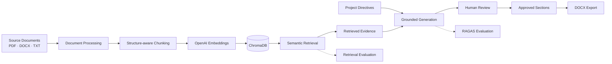
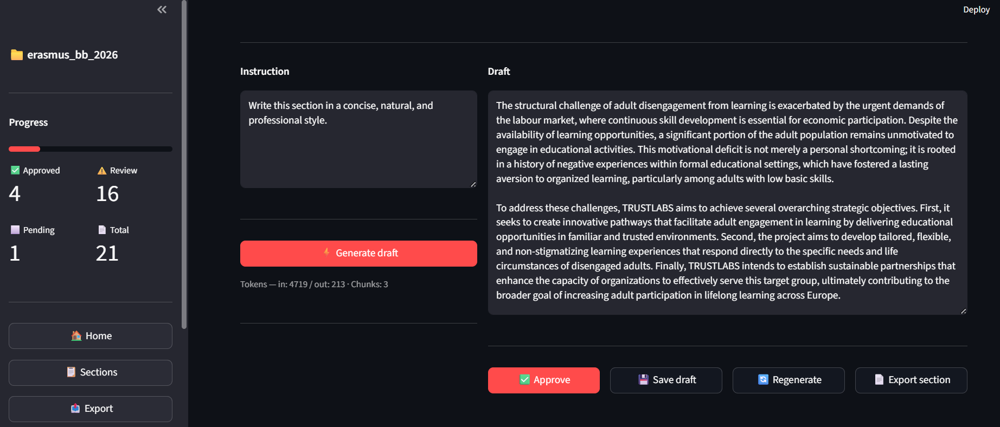

# RAG Proposal Assistant

[](https://github.com/DanielHG-182/rag-proposal-assistant/actions/workflows/ci.yml)

RAG Proposal Assistant is an end-to-end Retrieval-Augmented Generation system for evidence-grounded funding proposal drafting.

It combines structure-aware document processing, semantic retrieval, project-specific writing directives, grounded generation, human review, and exact retrieval-context traceability in a multi-project workflow.

**Evaluated performance:** Hit@3 **0.90** · Recall@3 **0.83** · Faithfulness **0.96** · Answer Relevancy **0.94**

Built with Python, OpenAI, ChromaDB, RAGAS, Streamlit, pytest, and GitHub Actions.



## Why This Project?

Preparing funding proposals often requires reviewing long application forms, programme documentation, previous materials, and internal organisational information.

This project explores how Retrieval-Augmented Generation (RAG) can help proposal teams:

* retrieve relevant information from multiple documents;
* generate structured proposal sections grounded in source material;
* reduce unsupported or invented claims;
* maintain project-specific writing directives;
* review and approve generated sections;
* preserve project-level context across the drafting workflow;
* export final proposals to Microsoft Word;
* evaluate both retrieval and generation quality.

## Application Workflow



The drafting interface combines project-specific instructions, grounded generation, human review, regeneration, and section-level export in a single workflow.

## Current Status

The core application is implemented and functional end to end, including document ingestion, chunking, indexing, retrieval, grounded drafting, human review, evaluation, and Microsoft Word export.

The repository includes:

* automated tests;
* GitHub Actions continuous integration;
* multi-project configuration and isolated project data;
* retrieval evaluation;
* RAGAS-based generation evaluation;
* pipeline telemetry and audit outputs;
* a local Streamlit interface;
* CLI pipeline stages for processing, indexing, testing, and evaluation.

## How It Works

RAG Proposal Assistant implements an end-to-end Retrieval-Augmented Generation pipeline.

### Pipeline Stages

The pipeline can be executed through the command line using the following stages:

| Stage            | Purpose                                                         |
| ---------------- | --------------------------------------------------------------- |
| `conversion`     | Extracts and normalises content from source documents           |
| `chunking`       | Divides processed documents into structured, retrievable chunks |
| `indexing`       | Generates embeddings and stores chunks in ChromaDB              |
| `retrieval-test` | Tests semantic retrieval for a query                            |
| `draft-test`     | Generates a proposal section using retrieved evidence           |
| `export-test`    | Runs a quick Microsoft Word export smoke test                   |
| `eval-generate`  | Produces a synthetic evaluation dataset                         |
| `evaluate`       | Evaluates retrieval and generation quality using RAG metrics    |

The Streamlit interface provides a visual workflow for managing projects, reviewing sections, generating drafts, inspecting retrieved evidence, approving content, and exporting documents.

## Key Features

* Multi-format document ingestion for PDF, DOCX, and TXT files
* Structure-aware document processing with table extraction
* Hierarchical chunking with overlap, metadata, and stable identifiers
* OpenAI embeddings for document indexing and query representation
* Persistent vector storage with ChromaDB
* Semantic retrieval of relevant proposal evidence
* Evidence-grounded proposal section generation
* Exact retrieval-context traceability in the drafting interface
* Project-specific writing directives and context injection
* Human review and approval workflow through Streamlit
* Downstream review tracking when previously approved content changes
* Microsoft Word export with optional document templates
* Synthetic evaluation dataset generation
* Retrieval and generation evaluation with RAGAS
* Pipeline telemetry and audit outputs
* Retry and exponential backoff handling for OpenAI API failures
* Automated tests and GitHub Actions continuous integration
* Project isolation through configurable folder structures

## Tech Stack

| Area                       | Technology                           |
| -------------------------- | ------------------------------------ |
| Language                   | Python                               |
| User interface             | Streamlit                            |
| LLM and embeddings         | OpenAI API                           |
| Vector database            | ChromaDB                             |
| PDF processing             | PyMuPDF and pdfplumber               |
| Word processing            | python-docx                          |
| Evaluation                 | RAGAS, Hugging Face Datasets, Pandas |
| LLM evaluation integration | LangChain OpenAI                     |
| Reliability                | Tenacity                             |
| Testing                    | pytest                               |
| Continuous integration     | GitHub Actions                       |
| Configuration              | python-dotenv                        |

## Installation

### 1. Clone the repository

```bash
git clone https://github.com/DanielHG-182/rag-proposal-assistant.git
cd rag-proposal-assistant
```

### 2. Create a virtual environment

On Windows:

```powershell
python -m venv .venv
.venv\Scripts\activate
```

On macOS or Linux:

```bash
python -m venv .venv
source .venv/bin/activate
```

### 3. Install dependencies

```bash
python -m pip install --upgrade pip
pip install -r requirements.txt
```

### 4. Configure environment variables

Copy the example configuration.

On Windows:

```powershell
Copy-Item .env.example .env
```

On macOS or Linux:

```bash
cp .env.example .env
```

Then open `.env` and add your OpenAI API key:

```dotenv
OPENAI_API_KEY=your_api_key_here
```

Keep `.env` local and never commit it to version control.

The remaining variables already include sensible defaults and only need to be changed when using a custom folder structure, model, retrieval configuration, Chroma collection, chunking configuration, or Word template.

## Running the Application

### Streamlit Interface

On Windows, you can use:

```powershell
.\startApp.bat
```

Or launch Streamlit directly:

```powershell
streamlit run app.py
```

### Command-Line Pipeline

General syntax:

```powershell
python main.py --stage <stage> --project <project_name>
```

Example:

```powershell
python main.py --stage indexing --project demo_project
```

To see all available options:

```powershell
python main.py --help
```

## Testing

Install the development dependencies:

```bash
pip install -r requirements-dev.txt
```

Run the full test suite:

```bash
python -m pytest -q
```

The same test suite is executed automatically through GitHub Actions on pushes and pull requests to `main`.

The CI workflow also verifies dependency consistency and runs a CLI smoke test.

## Repository Structure

```text
.
|-- app.py
|-- main.py
|-- requirements.txt
|-- requirements-dev.txt
|-- .env.example
|-- startApp.bat
|
|-- .github/
|   `-- workflows/
|       `-- ci.yml
|
|-- experiments/
|   `-- retrieval_reranking.py
|
|-- projects/
|   `-- <project_name>/
|       |-- config/
|       |   |-- directives.md
|       |   `-- index.json
|       |-- data/
|       |   |-- raw/
|       |   |-- processed/
|       |   |-- chunks/
|       |   `-- evaluation/
|       |-- vector_db/
|       |-- output/
|       `-- progress.json
|
|-- scripts/
|   |-- clients.py
|   |-- config.py
|   |-- directives.py
|   |-- document_processor.py
|   |-- chunker.py
|   |-- indexer.py
|   |-- retriever.py
|   |-- prompts.py
|   |-- redactor.py
|   |-- exporter.py
|   |-- project_service.py
|   |-- section_service.py
|   |-- generate_synthetic_dataset.py
|   |-- evaluator.py
|   `-- utils/
|       `-- paths.py
|
|-- tests/
|   |-- test_chunker.py
|   |-- test_document_processor.py
|   |-- test_paths.py
|   |-- test_project_service.py
|   |-- test_retriever.py
|   `-- test_section_service.py
|
`-- views/
    |-- home.py
    |-- sections_manager.py
    |-- redactor.py
    `-- export.py
```

### Main Components

* `app.py` starts the Streamlit application and handles page navigation.
* `main.py` exposes the command-line pipeline stages.
* `scripts/config.py` centralises typed runtime settings for models and retrieval.
* `scripts/clients.py` creates shared OpenAI and ChromaDB clients.
* `scripts/document_processor.py` converts PDF, DOCX, and TXT documents into clean Markdown.
* `scripts/chunker.py` creates structured chunks with metadata and stable identifiers.
* `scripts/indexer.py` generates embeddings and stores them in ChromaDB.
* `scripts/retriever.py` performs semantic evidence retrieval.
* `scripts/directives.py` loads and resolves project-specific writing directives.
* `scripts/prompts.py` builds grounded generation prompts.
* `scripts/redactor.py` coordinates retrieval, prompt construction, and draft generation.
* `scripts/exporter.py` creates Microsoft Word documents.
* `scripts/project_service.py` manages project lifecycle operations.
* `scripts/section_service.py` manages section state, approval, and persistence.
* `scripts/generate_synthetic_dataset.py` creates evaluation question-answer pairs from project material.
* `scripts/evaluator.py` evaluates retrieval and generation performance.
* `experiments/` contains isolated retrieval experiments that are not part of the production pipeline.
* `views/` contains the Streamlit interface.
* `tests/` contains the automated test suite.
* `config/index.json` defines the hierarchical proposal section structure used by the project.
* `projects/` provides an isolated directory structure for each project's configuration, documents, indexes, outputs, evaluation data, and progress.

Project-specific source documents, generated content, vector databases, outputs, writing directives, and runtime progress files are excluded from version control.

Section structure files such as `config/index.json` may be versioned when they are used as reproducible project configuration or examples.

## Evaluation

The project includes a dedicated evaluation pipeline covering both retrieval performance and grounded answer generation.

Evaluation is treated separately from the interactive drafting workflow so that changes to chunking, retrieval, ranking, prompting, and generation can be measured before being adopted.

### Retrieval Evaluation

The current retrieval configuration uses:

* `text-embedding-3-small` embeddings;
* ChromaDB vector storage;
* structure-aware chunks;
* deterministic retrieval evaluation;
* ranked retrieval metrics.

Representative results from the latest evaluation cycle were approximately:

| Metric   | Result |
| -------- | -----: |
| Hit@1    |   0.65 |
| Hit@3    |   0.90 |
| Recall@3 |   0.83 |

These results indicate that relevant evidence is usually present within the first three retrieved chunks, although ranking the correct evidence consistently at position one remains an area for further improvement.

### Generation Evaluation

Grounded generation is evaluated with RAGAS metrics using retrieved project evidence and an LLM judge.

Representative factual-question results from the latest evaluation cycle were approximately:

| Metric            | Result |
| ----------------- | -----: |
| Faithfulness      |   0.96 |
| Answer Relevancy  |   0.94 |
| Context Recall    |   1.00 |
| Context Precision |   0.93 |

The evaluation pipeline also records telemetry and audit information so retrieval context, generated answers, latency, and evaluation outputs can be inspected after each run.

The strongest results are currently obtained on factual questions where the required evidence is present in the project knowledge base.

Multi-hop questions that require combining evidence distributed across several parts of the source material remain a known retrieval challenge.

These results should be interpreted as project-level engineering benchmarks rather than as general-purpose RAG performance claims.

## Security and Privacy

This repository does not include real proposal documents, generated project content, API keys, vector databases, or runtime progress files.

Sensitive and generated resources are excluded through `.gitignore`, including:

* `.env` files and Streamlit secrets;
* source PDF and Word documents;
* processed documents and chunks;
* ChromaDB indexes;
* generated outputs;
* project writing directives;
* runtime progress files;
* downloaded machine learning models.

Project names are validated before paths are created to prevent path traversal outside the configured projects directory.

OpenAI API credentials are loaded from environment variables and are never hardcoded or printed by the application.

Static security analysis has also been performed with Bandit.

## Current Limitations

* The application currently depends on OpenAI for embeddings and text generation.
* Retrieval is embedding-based; hybrid sparse/dense retrieval is not currently implemented.
* Multi-hop retrieval remains more challenging than single-evidence factual retrieval.
* Generated proposal sections require human review before use.
* Evaluation currently relies substantially on synthetic question-answer datasets and would benefit from a larger expert-reviewed benchmark.
* The Streamlit interface is designed primarily for local use and does not include user authentication.
* The application is not currently deployed as a public hosted service.

## Design Principles

The project follows several engineering principles intended to keep the system understandable and reproducible:

* project data is isolated by project;
* generated claims should remain grounded in retrieved evidence;
* missing evidence should not be silently invented;
* retrieval and generation quality should be measured rather than assumed;
* UI code and project lifecycle logic are kept separate where practical;
* configuration is environment-driven rather than hardcoded;
* human review remains part of the proposal-writing workflow;
* technical changes are validated through automated tests and CI.

## License

This project is licensed under the MIT License. See the `LICENSE` file for details.
